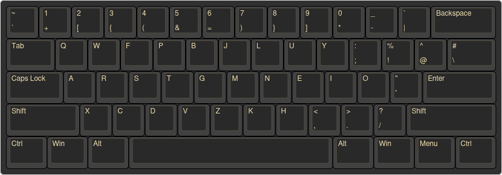

# My layout

My custom layout. Only chaged symbols making it easier on my wrists to type them.

Copy or symlink this file to system keyboard layout directory
```bash
cp prog-qwerty /usr/share/X11/xkb/symbols/prog-qwerty
```

## X11
On X11 you might need to update the `sudo vim /usr/share/X11/xkb/rules/evdev.xml`
with the following, add it near the other English keyboards

```
<variant>
    <configItem>
        <name>prog-qwerty</name>
        <description>English (Programmers Qwerty)</description>
    </configItem>
</variant>
```

Or just running `setxkbmap -layout prog-qwerty` should suffice

## Wayland

For hyprland add this to your config

```
input {
    kb_layout = prog-qwerty
}
```

For sway add the following
```
input type:keyboard {
  xkb_layout "prog-qwerty"
}
```

For any other wayland compositors you wanna check their docs on keyboard layouts

## Preview

